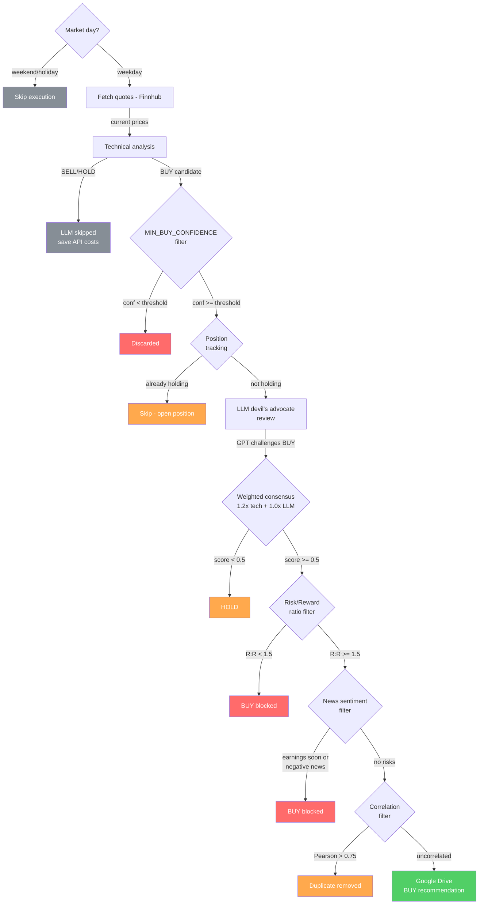

# Trading Advisor

Automated stock trading signal generator that combines **LLM analysis (GPT)** with **quantitative technical analysis** to produce consensus-based BUY/HOLD/SELL recommendations. Runs daily via GitHub Actions and saves results to Google Drive.

## 🚀 Features

### Decision Engine
- **Weighted consensus system** — Technical model (1.2x weight) + GPT (1.0x weight), combined score must reach ≥0.5 for BUY
- **LLM as devil's advocate** — GPT reviews setups critically, confirms BUY only when no significant risks are found
- **Three modes** via `FORCE_OPINION`: `DEFAULT` (consensus), `LLM1` (GPT only), `CUSTOM` (technical only)
- **LLM confidence** — GPT returns a 0-100% conviction score that weights its vote in the consensus
- **MIN_BUY_CONFIDENCE** — Pre-filter: minimum technical confidence to enter consensus (0.0-1.0, default 0.5)
- **Risk/Reward filter** — Blocks BUY signals with R:R ratio < 1.5 (ATR-based stop-loss vs take-profit)
- **News sentiment filter** — Blocks BUY signals when upcoming earnings or strongly negative news detected (Finnhub + GPT)
- **Position tracking** — Skips BUY if symbol already has an open (unsold) position
- **Signal diversity scoring** — Penalizes confidence when BUY signal comes from < 3 independent categories (trend/momentum/volume/structure/context)
- **Adaptive take-profit** — Uses the more conservative of fixed REVENUE_PERCENTAGE and 3×ATR
- **Market day guard** — Skips execution on weekends and US holidays to avoid stale prices
- **LLM cost optimization** — Only calls GPT for BUY candidates; SELL/HOLD signals skip LLM

### Technical Analysis (`custom_financial_calc.py`)
- **Trend**: SMA 50/200, EMA 20, MA50 slope
- **Momentum**: RSI, MACD (crossover + histogram), ROC 10, Stochastic RSI
- **Volume**: OBV, volume breakout confirmation
- **Volatility**: Bollinger Bands, ATR 14, historical volatility
- **Support/Resistance**: Fibonacci retracements (38.2%, 50%, 61.8%)
- **Patterns**: Candlestick detection (Hammer, Engulfing, Doji, Shooting Star)
- **Trend Strength**: ADX with dynamic signal weighting (trending vs ranging regimes)
- **Multi-timeframe**: Weekly MA10/MA30 and weekly RSI as confirmation layer
- **Market Context**: S&P500 trend as macro filter

### Risk Management (`risk_management.py`)
- **Stop-loss**: ATR-based (2x ATR below entry)
- **Take-profit**: Revenue percentage target or 3x ATR
- **Position sizing**: Fixed-risk model with 20% portfolio cap per position
- **Diversification**: Correlation filter removes highly correlated BUY signals (Pearson > 0.75)
- **Risk/Reward ratio**: Computed for every signal

### Backtesting (`backtesting.py`)
- Simulates signals over historical data **without look-ahead bias**
- Measures win rate, average return, max drawdown per trade
- Multi-stock backtest results (10% target, 30-day hold, 5 years):
  - **NVDA**: 58.8% win rate, +10.43% avg return
  - **META**: 47.9% win rate, +7.04% avg return
  - **MSFT**: 24.4% win rate, +2.21% avg return
  - System works best on volatile tech stocks
- Run all backtests: `python run_backtest_all.py`
- Normalize CSV formats: `python normalize_csvs.py`

### Infrastructure
- **Daily execution** via GitHub Actions (scheduled cron)
- **Google Drive** integration for persisting analysis and recommendations
- **93 tests**, fully mocked (no external API calls), ~12s execution

## 🛠️ Getting Started

### Prerequisites

- Python 3.11+
- API keys: OpenAI, Finnhub, Alpha Vantage
- Google Drive service account credentials

### Installation

```bash
git clone https://github.com/manu-gt-hub/trading_advisor.git
cd trading_advisor
pip install -r requirements.txt
```

### Environment Variables

| Variable | Description |
|---|---|
| `OPENAI_API_KEY` | OpenAI API key |
| `GPT_MODEL_NAME` | GPT model (e.g., `gpt-4o`) |
| `FINNHUB_API_KEY` | Finnhub API key |
| `ALPHA_API_KEY` | Alpha Vantage API key |
| `ALPHA_VANTAGE_URL` | Alpha Vantage base URL |
| `GDRIVE_CREDENTIALS_JSON` | Google Drive service account JSON |
| `GDRIVE_FILE_ID` | Transactions sheet ID |
| `BUY_RECOMMENDATIONS_ID` | Buy recommendations sheet ID |
| `ANALYSIS_FILE_ID` | Full analysis sheet ID |
| `SYMBOLS_INTEREST_LIST` | Python list of tickers, e.g. `"['AAPL','MSFT']"` |
| `REVENUE_PERCENTAGE` | Target profit % for take-profit (e.g., `10`) |
| `FORCE_OPINION` | Decision mode: `DEFAULT`, `LLM1`, `LLM2`, `CUSTOM` |
| `MIN_BUY_CONFIDENCE` | Minimum technical confidence to accept a BUY (0.0-1.0, default 0.5) |
| `LOG_LEVEL` | Logging level (`DEBUG`, `INFO`, `WARNING`) |
| `TRANSACTIONS_MAX_RECORDS` | Max rows in transactions sheet (default 100) |
| `NEWS_SENT_ANALYSIS` | Enable news sentiment filter (`true`/`false`, default `false`) |

### Usage

1. Set environment variables (`.env` file or GitHub Actions secrets)
2. Add symbols to `SYMBOLS_INTEREST_LIST`
3. Add market mapping in `resources/symbols_markets.json`
4. Run: `python main.py` (or `python main.py --test` for debug output)

### Google Drive Output

| Sheet | Columns |
|---|---|
| **Analysis** | symbol, current_price, llm_opinion, llm_confidence, manual_financial_analysis, technical_confidence, stop_loss, take_profit, risk_reward_ratio, action |
| **Buy Recommendations** | Same + buy_date, tradingview_url |

## 🧪 Tests

```bash
# Run all tests (excludes Google Drive integration tests)
pytest test/ -v --ignore=test/test_google_handler.py

# Run with output visible
pytest test/ -v -s --ignore=test/test_google_handler.py

# Run only backtesting tests
pytest test/test_backtesting.py -v -s

# Run E2E (requires all API keys)
python main.py --test
```

All tests are mocked — no external API calls. Google Drive tests (`test_google_handler.py`) are integration tests excluded by default.

## � Signal Pipeline



## �� Architecture

```
main.py                          # Entry point: orchestrates analysis pipeline
tools/
  custom_financial_calc.py       # Technical indicators + scoring engine
  general.py                     # Consensus logic, decision extraction, action column
  llms.py                        # GPT and DeepSeek API integration
  risk_management.py             # Stop-loss, position sizing, correlation filter
  backtesting.py                 # Historical signal simulation
  historicals.py                 # Yahoo Finance + Alpha Vantage data fetching
  finnhub_client.py              # Finnhub market data
  google_handler.py              # Google Drive read/write
  email_handler.py               # Email notifications
  news_sentiment.py              # Finnhub news + earnings + GPT sentiment filter
test/                            # 93 tests, fully mocked
resources/                       # CSV data, symbol mappings
.github/workflows/               # CI (tests) + daily execution
```

## ⚠️ Disclaimer

This repository is for **educational and personal use only**. It is not financial advice. Trading involves risk of loss. Use responsibly and at your own risk.
