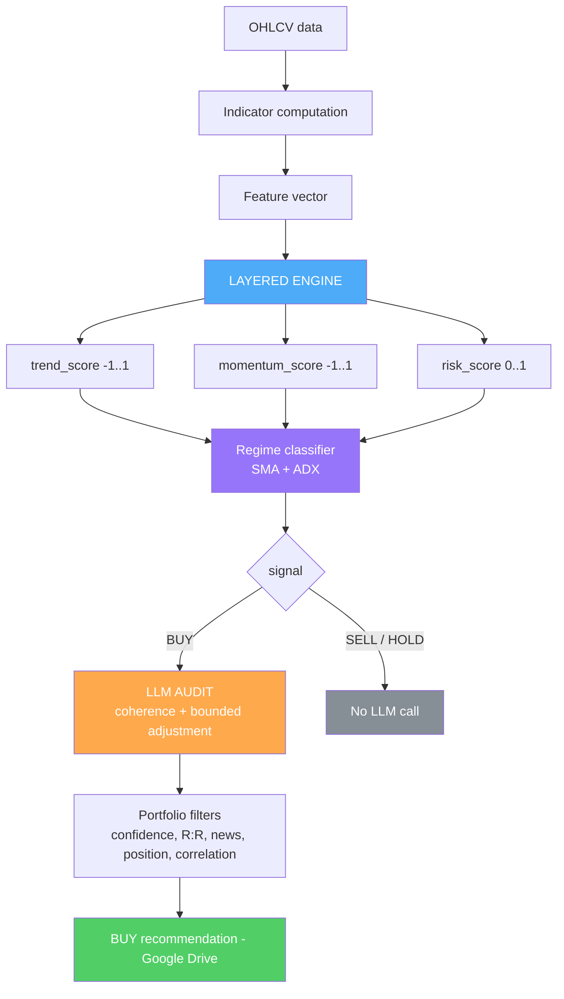

# 01 — Architecture and data flow

## Overview

The system turns price/volume data into a structured, deterministic **BUY / HOLD / SELL** decision, and only afterwards submits BUY signals to an LLM audit.



## Components

### 1. Indicator computation — `tools/custom_financial_calc.py`
`evaluate_buy_interest(symbol, df, current_price)`:
1. Cleans the `DataFrame` and requires **>= 200 rows** of history.
2. Computes all indicators: SMA50/200, EMA20, RSI, MACD (+signal, histogram, slope), ROC, ADX (+DI/-DI), Stochastic RSI, OBV, Bollinger, ATR, volatility, breakout, Fibonacci, candlestick patterns, weekly confirmation, S&P500 context, monthly probability.
3. Detects **bearish divergence** (a risk factor).
4. Builds a **feature vector** with the raw values.
5. Calls `technical_engine.decide(features)` — **this is where the decision is made**.
6. Returns a structured output (see below). Indicators that do not feed the score (Bollinger, Fibonacci, candlesticks, market context, monthly probability) are **reported** in `signals` but do not affect the decision.

### 2. Layered engine — `tools/technical_engine.py`
**The sole decision maker.** See [`02_indicators_and_layers.md`](02_indicators_and_layers.md) and [`03_regime_and_decision.md`](03_regime_and_decision.md).

### 3. LLM auditor — `tools/llms.py`
`audit_buy_signal(...)` is called only for BUY. See [`04_llm_audit.md`](04_llm_audit.md).

### 4. Orchestration and filters — `main.py` + `tools/general.py`
See [`05_pipeline_and_filters.md`](05_pipeline_and_filters.md).

## Structured engine output

`evaluate_buy_interest` returns:

```python
{
  "symbol": "MSFT",
  "evaluation": "BUY",        # == signal (compatibility)
  "signal": "BUY",            # BUY | SELL | HOLD
  "strength": "STRONG",       # WEAK | MODERATE | STRONG
  "regime": "TRENDING_UP",    # TRENDING_UP | TRENDING_DOWN | RANGE | DISTRIBUTION
  "confidence": 0.74,         # risk-adjusted directional score, in [-1, 1]
  "sub_scores": {
    "trend_score": 0.85,      # [-1, 1]
    "momentum_score": 0.68,   # [-1, 1]
    "risk_score": 0.06        # [ 0, 1]  (0 = no risk, 1 = maximum risk)
  },
  "factors": {                # deterministic per-layer breakdown
    "trend":    { "sma_cross": 0.96, "price_vs_sma200": 0.90, ... },
    "momentum": { "rsi": 0.60, "macd": 1.0, ... },
    "risk":     { "volatility": 0.25, "divergence": 0.0, ... }
  },
  "active_signals": [ "signal=BUY", "regime=TRENDING_UP", "trend.sma_cross=0.96", ... ],
  "signals": { ... all raw reported indicators ... }
}
```

**No narrative text**: `active_signals` are deterministic `key=value` pairs, not sentences.

## Determinism

Given the same feature vector, the engine **always** produces the same result (no randomness and no LLM dependency in the classification). This enables backtesting without look-ahead bias (`tools/backtesting.py`).
