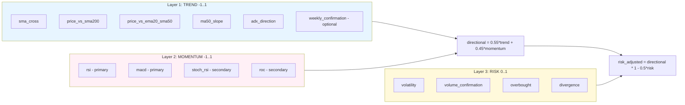

# 02 — Indicators, layers and normalization

The system splits the analysis into **three layers with a clear hierarchy**. Each indicator is **normalized to a common scale** before being aggregated. Layers do not mix: each one produces an independent *sub-score*.

| Layer | Scale | Meaning | Layer weight |
|---|---|---|---|
| `trend` | `[-1, 1]` | Directional structure of price | `0.55` |
| `momentum` | `[-1, 1]` | Speed/strength of the move | `0.45` |
| `risk` | `[0, 1]` | Penalty (0 = no risk, 1 = max risk) | — (penalizes) |

> All weights live in `resources/technical_config.json`. Within each layer the weights are **relative**: the aggregator (`_weighted_average`) divides by the sum of the weights of the indicators present, so if an optional indicator is missing, the rest are **renormalized** automatically.

---

## Layer 1 — TREND `[-1, 1]`

Measures whether the price structure is bullish or bearish.

| Indicator | Weight | Normalization |
|---|---|---|
| `sma_cross` | 0.25 | `clip(tanh(((SMA50 - SMA200) / |SMA200|) * 20), -1, 1)` |
| `price_vs_sma200` | 0.15 | `clip(tanh(((price - SMA200) / |SMA200|) * 10), -1, 1)` |
| `price_vs_ema20_sma50` | 0.15 | `+1` if price > EMA20 and > SMA50; `-1` if < both; `0` mixed |
| `ma50_slope` | 0.10 | `clip(tanh((MA50_slope / |price|) * 100), -1, 1)` |
| `adx_direction` | 0.15 | `clip(((+DI - -DI)/(+DI + -DI)) * min(ADX/40, 1), -1, 1)` |
| `weekly_confirmation` | 0.20 *(optional)* | `clip(0.5*(MA10w>MA30w ? +1 : -1) + 0.5*(price>MA10w ? +1 : -1), -1, 1)` |

**`weekly_confirmation` (multi-timeframe confirmation):** confirms the daily trend against the **weekly** one (weekly MA10/MA30 and price vs weekly MA10). It reduces false BUYs caused by daily noise. It is **optional**: if there is insufficient weekly history (`_compute_weekly_confirmation` returns `None`), the factor is omitted and the remaining trend weights are renormalized.

`trend_score` = weighted average of the present factors.

---

## Layer 2 — MOMENTUM `[-1, 1]`

Measures the strength of the move. **RSI and MACD are PRIMARY** (high weight); **Stoch RSI and ROC are SECONDARY** (low weight). They are not mixed with the same weight, to avoid redundancy.

| Indicator | Tier | Weight | Normalization |
|---|---|---|---|
| `rsi` | primary | 0.35 | `clip((RSI - 50) / 20, -1, 1)` |
| `macd` | primary | 0.35 | `clip(0.5*sign(MACD-Signal) + 0.25*sign(hist_slope) + 0.25*cross, -1, 1)` |
| `stoch_rsi` | secondary | 0.15 | `clip((%K - 50) / 50, -1, 1)` |
| `roc` | secondary | 0.15 | `clip(tanh(ROC * 10), -1, 1)` |

`macd` detail:
- `sign(MACD - Signal)` -> +/-0.5 (MACD above/below its signal).
- `sign(histogram_slope)` -> +/-0.25 (histogram rising/falling).
- `cross` -> +/-0.25 if there is a **fresh crossover** (bullish/bearish) on the last bar (`macd_cross`), 0 otherwise.

`momentum_score` = weighted average.

---

## Layer 3 — RISK `[0, 1]`

Risk penalty. **Volume and divergences live HERE**, not in momentum. `0` = no risk, `1` = maximum risk.

| Indicator | Weight | Normalization |
|---|---|---|
| `volatility` | 0.25 | `clip(volatility_20 / 0.04, 0, 1)` |
| `volume_confirmation` | 0.25 | `+0.5` if volume < 20-day volume SMA; `+0.5` if OBV < 20-day OBV SMA; `0.3` if no volume data |
| `overbought` | 0.25 | `clip((RSI - 70)/30, 0, 1)`; raised to `>= 0.6` if price touches/exceeds the upper Bollinger band |
| `divergence` | 0.25 | `1.0` if bearish price/OBV or price/RSI divergence; `0` otherwise |

**Bearish divergence** (`_detect_bearish_divergence`): price makes a higher high while OBV or RSI makes a lower high within a 14-bar window -> exhaustion signal -> **risk**, never momentum.

`risk_score` = weighted average (always in `[0, 1]`).

---

## Reported but NOT scored indicators

They are computed and appear in `signals` for inspection/audit, but **do not feed the score**:
- Bollinger Bands (unless price touches the upper band -> enters as `overbought` risk).
- Fibonacci levels (38.2 / 50 / 61.8 %).
- Candlestick patterns (Hammer, Engulfing, Doji, Shooting Star).
- S&P500 market context (`Market_Trend`).
- Historical monthly probability of +10% (`Monthly_10pct_Prob`).

This keeps the hierarchy clean: only factors with a clear role in trend / momentum / risk enter the score.
