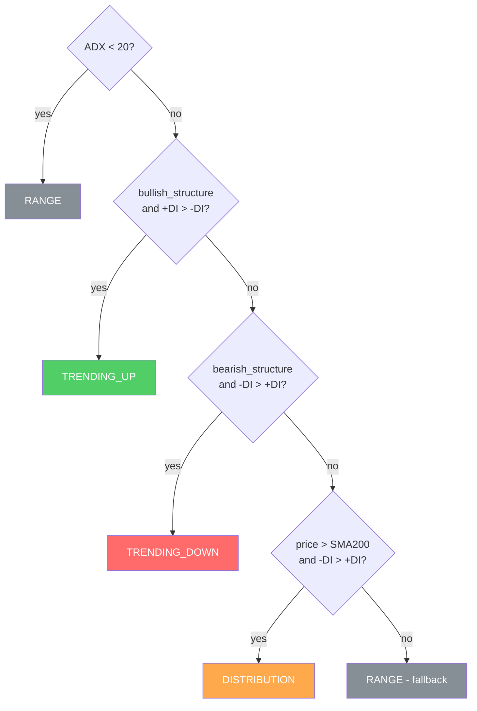
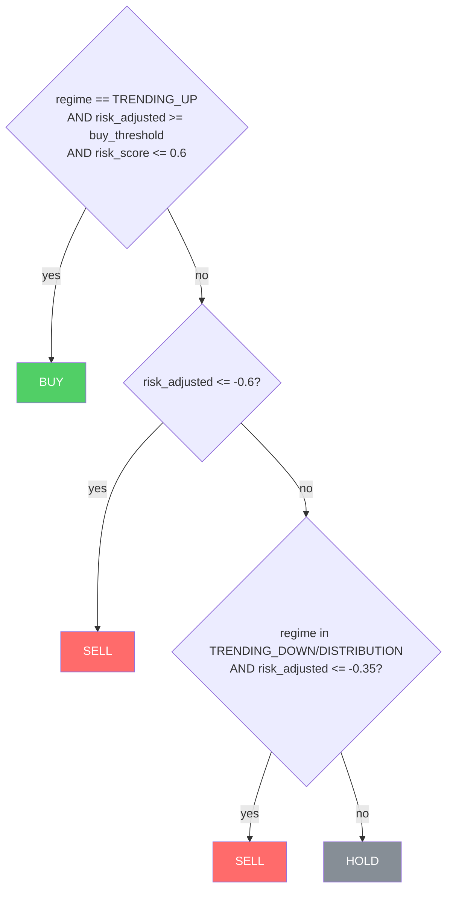

# 03 — Regime and BUY / HOLD / SELL generation

This document describes how the engine goes from the three *sub-scores* to a final signal. Everything is **deterministic** and lives in `tools/technical_engine.py` (`classify_regime` and `decide`).

## Step 1 — Regime classifier (SMA + ADX)

The regime describes the market **context**. It is computed **only** from SMA(50/200), ADX and direction (+DI/-DI). There are exactly 4 classes.

Variables:
- `bullish_structure` = `SMA50 > SMA200` **and** `price > SMA200`
- `bearish_structure` = `SMA50 < SMA200` **and** `price < SMA200`
- `adx_trend_min = 20` (trend-existence threshold)



> `DISTRIBUTION` captures the typical "top": price is still above SMA200 but direction is already bearish (-DI dominates). It is a **selling** regime, not a buying one.

## Step 2 — Layer aggregation

```
directional   = (trend_score * 0.55 + momentum_score * 0.45) / (0.55 + 0.45)
risk_adjusted = directional * (1 - 0.5 * risk_score)
confidence    = clip(risk_adjusted, -1, 1)
```

- `directional` in `[-1, 1]`: pure direction (trend + momentum weighted by layer weight).
- **Risk penalizes multiplicatively**: with `risk_score = 1`, confidence is halved (`penalty_factor = 0.5`).
- `confidence` is the number later compared with the thresholds and that the LLM may adjust.

## Step 3 — Regime-gated decision

`buy_threshold` = environment variable **`MIN_BUY_CONFIDENCE`** (default `0.6`). It is the **single knob** for the BUY threshold (see [`06_configuration.md`](06_configuration.md)).



Key consequences (aligned with the **high-precision** goal):
- **You only buy in `TRENDING_UP`.** In `RANGE` or `DISTRIBUTION` there is never a BUY, no matter how strong the momentum.
- **High risk blocks the BUY** even if direction is strong (`risk_score > 0.6`).
- Selling is more permissive: a sharp drop (`risk_adjusted <= -0.6`) yields SELL in any regime; in bearish regimes `<= -0.35` is enough.

## Step 4 — Signal strength (`strength`)

From `|risk_adjusted|`:

| `|risk_adjusted|` | `strength` |
|---|---|
| >= 0.70 | **STRONG** |
| >= 0.45 | **MODERATE** |
| < 0.45 | **WEAK** |

`strength` is informational (it accompanies the signal); it does not change the classification by itself.

## Numeric example (BUY)

For a clearly bullish case in `TRENDING_UP`:
- `trend_score ~ 0.85`, `momentum_score ~ 0.68`, `risk_score ~ 0.06`.
- `directional = 0.85*0.55 + 0.68*0.45 = 0.77`.
- `risk_adjusted = 0.77 * (1 - 0.5*0.06) = 0.747`.
- `0.747 >= 0.6` and `0.06 <= 0.6` and regime `TRENDING_UP` -> **BUY**, `confidence ~ 0.75`, `strength = STRONG`.

## What happens after the signal

- If the signal is **BUY** -> it goes through the **LLM audit** ([`04_llm_audit.md`](04_llm_audit.md)) and the **portfolio filters** ([`05_pipeline_and_filters.md`](05_pipeline_and_filters.md)).
- If it is **SELL/HOLD** -> the LLM is not called (cost saving); the signal flows as-is.
