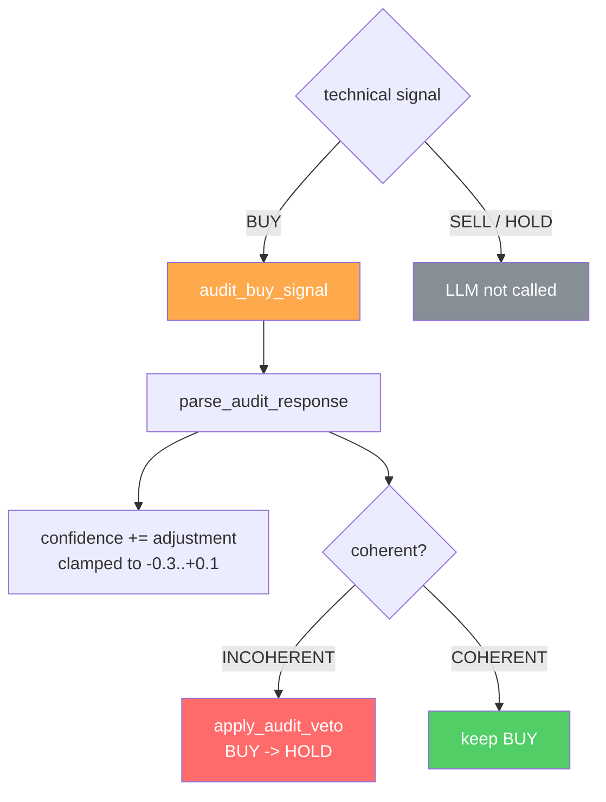

# 04 — LLM audit (GPT)

## Principle

> The LLM is **NOT** a second decision system. It is an **auditor**.

The technical engine has already decided. The LLM can only do two things, and only when the technical signal is **BUY**:

1. **Detect incoherences** between the structured output (regime, sub-scores) and the raw indicators.
2. **Adjust the final confidence** within narrow bounds.

It **never** re-classifies (it does not turn a HOLD/SELL into a BUY, nor propose a new decision).



## When it is invoked

In `main.py` (`enrich_analysis_df`), only if `evaluation == "BUY"`:

```python
if evaluation == "BUY":
    audit = llms.audit_buy_signal(metrics["signals"], symbol, current_price, technical_result)
    confidence = clip(confidence + audit["adjustment"], -1, 1)
    llm_opinion = f"{COHERENT|INCOHERENT} | adj={audit['adjustment']:+.2f} | {audit['reason']}"
```

For SELL/HOLD the LLM is **not called** (API cost saving).

## What the auditor receives — `tools/llms.py`

`generate_audit_prompt` sends:
- The signal (BUY) and the price.
- The structured output: `regime`, `strength`, `trend_score`, `momentum_score`, `risk_score`.
- The raw indicators (`signals`).
- The allowed adjustment range.

`audit_system_prompt` makes it explicit that it is an **auditor** that cannot change the decision, that it only verifies coherence and proposes a small adjustment.

## LLM output format

A single line, parsed by `parse_audit_response`:

```
COHERENT|INCOHERENT | adjustment=<float> | <reason, max 20 words>
```

`parse_audit_response` returns:

```python
{ "coherent": bool, "adjustment": float, "reason": str, "raw": str }
```

- `adjustment` is **clamped** to `confidence_adjustment_bounds` = `[-0.3, +0.1]` (asymmetric: it can penalize a lot, reward little).
- If parsing fails or the LLM is unavailable, the defaults are **conservative**: `coherent = True`, `adjustment = 0.0` (it neither rescues nor sinks due to a technical error).

## How it affects the final decision

The LLM influences via **two paths**, both without re-classifying:

### 1) Confidence adjustment
`confidence` (technical) `+= adjustment`. Since the BUY acceptance threshold (`MIN_BUY_CONFIDENCE`) is applied **afterwards**, a negative adjustment can push the BUY below the threshold and discard it in the portfolio filter.

### 2) Incoherence veto
In `tools/general.py`, `apply_audit_veto`:

```python
def apply_audit_veto(technical_decision, llm_opinion):
    if technical_decision == 'BUY' and 'INCOHERENT' in llm_opinion.upper():
        return 'HOLD'   # the only action allowed to the LLM
    return technical_decision
```

- If the auditor flags **INCOHERENT**, the technical BUY is downgraded to **HOLD**.
- The LLM **never** creates or improves a signal: it does nothing to a SELL/HOLD; for a BUY it can only lower it.

## Summary of LLM limits

| LLM action | Allowed? |
|---|---|
| Raise confidence (up to +0.1) | Yes |
| Lower confidence (down to -0.3) | Yes |
| Downgrade BUY -> HOLD (incoherence) | Yes |
| Turn HOLD/SELL -> BUY | **No** |
| Change the classification / regime | **No** |
| Decide when the technical signal is not BUY | **No** (it is not even called) |

> Earnings and news are **not** handled by the LLM: they are deterministic data and are filtered separately (see [`05_pipeline_and_filters.md`](05_pipeline_and_filters.md)).
