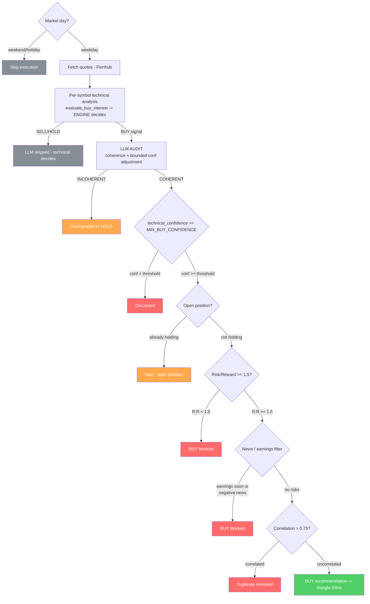

# 05 — Execution pipeline and portfolio filters

Describes the full `main.py` flow, from fetching prices to saving the recommendations. The technical signal is already decided by the engine; here we apply **portfolio management filters** that can only **block** a BUY, never create one.

## Execution order (`main()`)



## Step 4 — Enrichment (`enrich_analysis_df`)

For each symbol:
- If the signal is **BUY** -> calls `audit_buy_signal` (LLM), applies the confidence adjustment and stores `llm_opinion = "COHERENT|INCOHERENT | adj=... | reason"`.
- If it is **not** BUY -> the LLM is not called; `llm_opinion = "<EVAL> - LLM not called (technical decides)"`.
- Builds `manual_financial_analysis` (deterministic label):
  `"<confidence> <SIGNAL> | regime=..., strength=..., trend=..., momentum=..., risk=... | RSI=..., MACD=..., ADX=..."`
- Stores `technical_confidence` = **already-audited confidence**.
- Computes **stop-loss / take-profit / R:R** with `compute_stop_loss_take_profit` (see below).

## Step 5 — `action` column (`generate_action_column`)

Depending on `FORCE_OPINION`:

| Mode | Logic |
|---|---|
| `DEFAULT` (recommended) | `action` = technical decision (`manual_financial_analysis`); then `apply_audit_veto` downgrades BUY->HOLD if the LLM flagged INCOHERENT |
| `CUSTOM` | Technical only, no LLM veto |
| `LLM1` / `LLM2` | Legacy: uses the GPT output directly (not recommended with the current design) |

## Step 6 — Minimum confidence filter

```python
buy_df = analysis_df[(action == 'BUY') & (technical_confidence >= MIN_BUY_CONFIDENCE)]
```

`MIN_BUY_CONFIDENCE` (env, default `0.6`) is the **same knob** the engine uses as the BUY threshold. Here it acts **post-audit**: it catches cases where the LLM lowered confidence below the threshold. BUYs discarded for low confidence are logged.

## Step 7 — Open position

Loads the transactions; if the symbol already has a position without `sell_value`, the new BUY is discarded (no averaging or duplicating).

## Step 8 — Risk/Reward (`tools/risk_management.py`)

`compute_stop_loss_take_profit(price, ATR, revenue_percentage)`:
- **Stop-loss** = `price - 2*ATR`.
- **Take-profit** = the **more conservative** of the `REVENUE_PERCENTAGE %` target and `price + 3*ATR`.
- **R:R** = `(take_profit - price) / (price - stop_loss)`.

The BUY is **blocked** if `R:R < 1.5`. If R:R is unknown (`NaN`), it is not blocked.

## Step 9 — News and earnings (`tools/news_sentiment.py`)

`evaluate_news_filter(symbol, news_sentiment_enabled)` blocks the BUY if:
- There are **upcoming earnings** (`earnings_soon`), or
- News sentiment is markedly **negative** (when `NEWS_SENT_ANALYSIS=true`).

> Earnings are handled **here**, deterministically, **not** in the LLM. The `news_sentiment` and `earnings_soon` columns are always initialized so they appear in the Analysis sheet even when there are no BUY candidates.

## Step 10 — Correlation (diversification)

If >= 2 BUYs remain, `filter_correlated_buys(buy_df, max_correlation=0.75)` groups highly correlated ones (Pearson > 0.75 over recent history) and keeps, per group, the one with the **highest `technical_confidence`**.

## Step 11 — Output

- **Buy Recommendations** (Google Drive): symbols that passed all filters + `buy_date`, `stop_loss`, `take_profit`, `risk_reward_ratio`, `tradingview_url`.
- **Analysis**: all symbols with their evaluation, confidence, labels and `action`.

## Block map (everything that can stop a BUY)

| Stage | Blocks BUY if... |
|---|---|
| LLM audit | LLM flags INCOHERENT (-> HOLD) or lowers confidence |
| Confidence | `technical_confidence < MIN_BUY_CONFIDENCE` |
| Position | an open position for the symbol already exists |
| R:R | `risk_reward_ratio < 1.5` |
| News | upcoming earnings or strongly negative sentiment |
| Correlation | correlation > 0.75 with another higher-confidence BUY |

No filter can **create** a BUY: the only source of a BUY is the technical engine.
